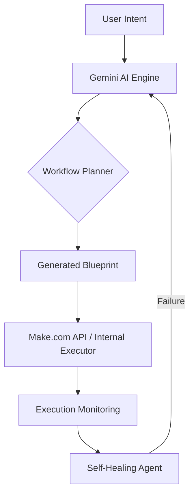

# Relay ⚡

### AI-Powered Automation Platform

**Relay** is an AI-powered automation platform that turns natural-language instructions into executable workflows.

Instead of manually configuring triggers, conditions, and actions, users simply describe what they want automated. Relay understands the intent, creates the workflow, executes it, monitors the result, and can assist with failures.

> **Describe the work. Let Relay handle the rest.**

## 🚧 Development Status & Prototype Disclaimer

**Relay is a prototype and not currently intended for enterprise-level production use.**

While the repository contains **actual functional code** and direct integrations with the Make.com API, it is primarily a proof-of-concept for AI-driven automation. To transition this into an enterprise-ready application, several critical steps are required:

1.  **End-to-End Testing**: Comprehensive automated testing for all automation flows and edge cases is necessary to ensure reliability.
2.  **Credential Management**: Users must provide their own **Google Cloud Console Credentials** (Client ID and Client Secret) and **Make.com API Tokens** to enable real-world functionality.
3.  **Security Hardening**: Further validation of credential storage and API communication patterns.

## ✨ Features & Capabilities

*   **🌐 Live Demo**: [View the Web Version on GitHub Pages](https://shubham230523.github.io/Relay/)
*   **Natural Language to Workflow**: Convert plain text instructions into structured, executable automations.
*   **Multi-Platform Support**: Built with Flutter for Android, iOS, Web, and Desktop.
*   **Deep Integrations**: Direct support for professional automation platforms like **Make.com**.
*   **AI-Native**: Powered by Google Gemini for intelligent decision-making and data extraction.
*   **Agentic Recovery**: Automated monitoring and failure analysis with self-healing capabilities.

## 🛠️ Technology Stack

### Frontend (Cross-Platform)
*   **Framework**: [Flutter](https://flutter.dev/) & [Dart](https://dart.dev/)
*   **State Management**: [Riverpod](https://riverpod.dev/) (Functional approach for reactive UI)
*   **Navigation**: [Go Router](https://pub.dev/packages/go_router)
*   **Persistence**: [Flutter Secure Storage](https://pub.dev/packages/flutter_secure_storage) for encrypted API keys and tokens.
*   **Theming**: Material 3 Responsive Design.

### AI Engine
*   **LLM**: [Google Gemini API](https://ai.google.dev/) via `google_generative_ai`.
*   **Capabilities**: Structured output parsing, intent classification, and automated planning.

### Integrations & Backend
*   **Make.com (Integromat)**: Programmatic scenario management via Make REST API v2.
*   **Google Workspace**: Integration-ready via Google Cloud OAuth 2.0 (requires user-provided Client ID/Secret).
*   **Communication**: [HTTP](https://pub.dev/packages/http) for custom REST integrations.

## 🏗️ Project Structure

The project follows a **Feature-First Clean Architecture**:

*   `lib/core`: Global constants, shared widgets, and base services.
*   `lib/features/integrations`: Management of external accounts (Make, Google Cloud).
*   `lib/features/automations`: The core engine for listing, creating, and managing workflows.
*   `lib/features/workflow_builder`: UI and logic for translating natural language into automation nodes.
*   `lib/features/dashboard`: High-level overview of execution stats and recent activities.

## 🔄 How Relay Works

## 🗺️ Roadmap

*   [x] Feature-First Flutter Foundation
*   [x] Make.com API Integration
*   [x] Secure Credential Persistence
*   [x] Template-based Automation Creation
*   [ ] Real-time Execution Logs
*   [ ] Visual Node-Based Workflow Editor
*   [ ] Advanced Agentic Recovery (Self-Healing)
*   [ ] Template Marketplace

## 🔐 Security

Relay prioritizes user privacy and security:
*   **OAuth 2.0**: Uses industry-standard authorization for external services.
*   **Local Encryption**: API Tokens and Secrets are stored in the device's secure enclave (Keychain/Keystore).
*   **Minimal Permissions**: We only request the specific scopes needed for your automations.

---

**Relay is an experimental project exploring how AI agents can transform natural-language instructions into reliable, executable automations.**
