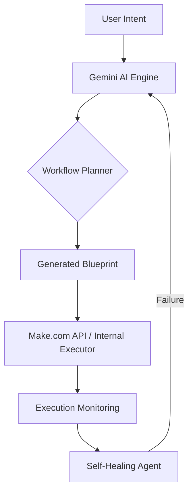

# Relay ⚡

### AI-Powered Automation Platform

**Relay** is an AI-powered automation platform that turns natural-language instructions into executable workflows.

Instead of manually configuring triggers, conditions, and actions, users simply describe what they want automated. Relay understands the intent, creates the workflow, executes it, monitors the result, and can assist with failures.

> **Describe the work. Let Relay handle the rest.**

## ✨ Features & Capabilities

*   **Natural Language to Workflow**: Convert plain text instructions into structured, executable automations.
*   **Multi-Platform Support**: Built with Flutter for Android, iOS, Web, and Desktop.
*   **Deep Integrations**: Direct support for Google Services (Gmail, Sheets) and professional automation platforms like **Make.com**.
*   **AI-Native**: Powered by Google Gemini for intelligent decision-making and data extraction.
*   **Agentic Recovery**: Automated monitoring and failure analysis with self-healing capabilities.

## 🛠️ Technology Stack

### Frontend (Cross-Platform)
*   **Framework**: [Flutter](https://flutter.dev/) & [Dart](https://dart.dev/)
*   **State Management**: [Riverpod](https://riverpod.dev/) (Functional approach for reactive UI)
*   **Navigation**: [Go Router](https://pub.dev/packages/go_router)
*   **Persistence**: [Flutter Secure Storage](https://pub.dev/packages/flutter_secure_storage) for encrypted API keys and tokens.
*   **Theming**: Material 3 Responsive Design.

### AI Engine
*   **LLM**: [Google Gemini API](https://ai.google.dev/) via `google_generative_ai`.
*   **Capabilities**: Structured output parsing, intent classification, and automated planning.

### Integrations & Backend
*   **Make.com (Integromat)**: Programmatic scenario management via Make REST API v2.
*   **Google Workspace**: Integrated Gmail and Google Sheets support via `googleapis` and OAuth 2.0.
*   **Communication**: [HTTP](https://pub.dev/packages/http) for custom REST integrations.

## 🏗️ Project Structure

The project follows a **Feature-First Clean Architecture**:

*   `lib/core`: Global constants, shared widgets, and base services (Slack, Gmail, Sheets).
*   `lib/features/integrations`: Management of external accounts (Google, Make, Slack).
*   `lib/features/automations`: The core engine for listing, creating, and managing workflows.
*   `lib/features/workflow_builder`: UI and logic for translating natural language into automation nodes.
*   `lib/features/dashboard`: High-level overview of execution stats and recent activities.

## 🔄 How Relay Works

## 🗺️ Roadmap

*   [x] Feature-First Flutter Foundation
*   [x] Make.com API Integration
*   [x] Google Sign-In & Workspace Scopes
*   [x] Secure API Key Storage
*   [ ] Real-time Execution Logs
*   [ ] Visual Node-Based Workflow Editor
*   [ ] Advanced Agentic Recovery (Self-Healing)
*   [ ] Template Marketplace

## 🔐 Security

Relay prioritizes user privacy and security:
*   **OAuth 2.0**: Uses industry-standard authorization for Google services.
*   **Local Encryption**: API Tokens (like Make.com keys) are stored in the device's secure enclave (Keychain/Keystore).
*   **Minimal Permissions**: We only request the specific scopes needed for your automations.

---

**Relay is an experimental project exploring how AI agents can transform natural-language instructions into reliable, executable automations.**
